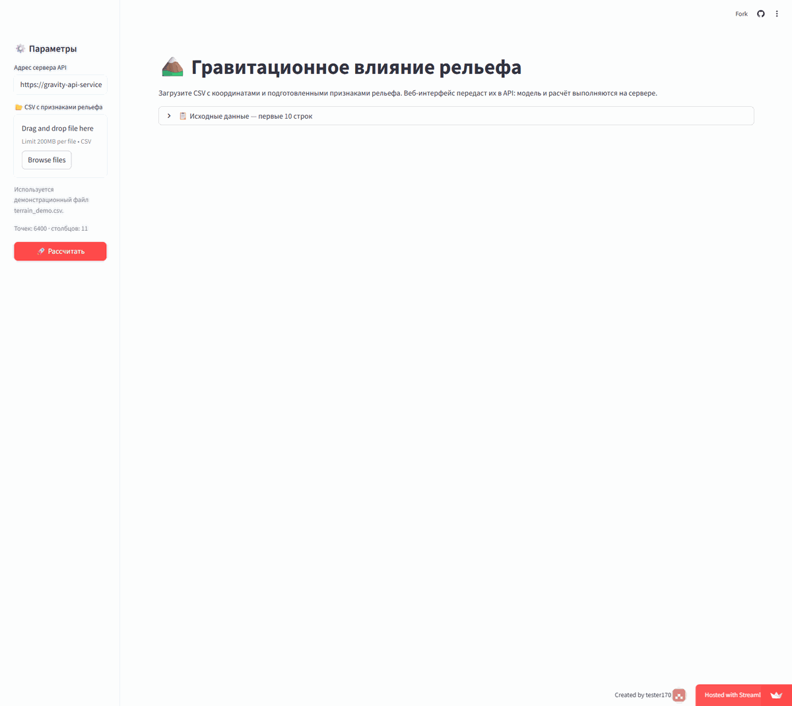
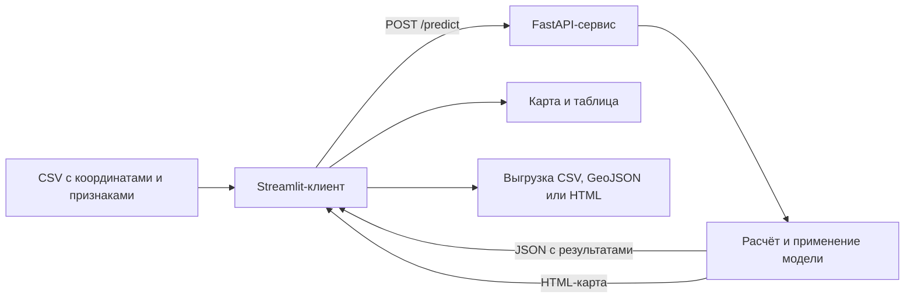

# 🏔️ Гравитационное влияние рельефа: веб-интерфейс к API

<div align="center">


### Клиентское приложение для работы с удалённым сервисом расчёта

[Открыть приложение](https://gravity-ui.streamlit.app/) · [Документация API](https://gravity-api-service.fastapicloud.dev/docs) · [Исходный код API](https://github.com/tester170/Gravity_API_Service)

</div>

---

## 🎬 Демонстрация

<div align="center">
  
</div>

В демонстрации используется встроенный файл на 6 400 точек: показаны предварительный просмотр CSV, получение результата от API, карта, таблица и варианты выгрузки.

## 🎯 Назначение

Приложение предоставляет веб-интерфейс к модели, развёрнутой отдельно от него. Пользователь выбирает CSV с координатами и подготовленными признаками рельефа; интерфейс отправляет данные в API. Сервер выполняет расчёт и возвращает числовые результаты и HTML-карту. Устанавливать модель на компьютер пользователя не требуется.

В отличие от приложения темы 2, интерфейс и вычислительная часть здесь не входят в один проект: Streamlit-клиент и FastAPI-сервис запускаются независимо и обмениваются данными по HTTP. Поэтому к одному API могут обращаться разные программы — например, этот веб-интерфейс, мобильное приложение или программа на компьютере. При смене размещения сервиса достаточно указать новый базовый адрес API в боковой панели.

## 🔄 Как проходят данные



По нажатию **«Рассчитать»** интерфейс отправляет два запроса: один получает таблицу в JSON, второй — готовую HTML-карту. Таблицу можно сохранить как CSV. Для GeoJSON клиент упаковывает координаты и атрибуты готовых строк результата в объекты типа `Point`. Это преобразование формата: модель не применяется повторно, а признаки не рассчитываются на стороне клиента.

## 📄 Входной CSV

В проект включён файл `data/terrain_demo.csv`. Он содержит 6 400 центров ячеек и 11 столбцов: широту, долготу и девять подготовленных признаков.

| Столбцы | Содержание |
|---|---|
| `latitude`, `longitude` | Широта и долгота в градусах; используются для карты, а не как признаки модели |
| `elevation_m` | Высота, м |
| `slope` | Модуль градиента высоты, м/м |
| `curvature` | Сумма вторых производных высоты по принятой формуле, 1/м |
| `tpi_7`, `tpi_31`, `tpi_121` | Разность высоты ячейки и среднего значения в окнах 7×7, 31×31 и 121×121 ячеек, м |
| `roughness_7`, `roughness_31` | Стандартное отклонение высот в окнах 7×7 и 31×31 ячеек, м |
| `relief_31` | Разность максимальной и минимальной высот в окне 31×31 ячейка, м |

Признаки должны быть подготовлены по тем же определениям, пространственной сетке и единицам, что и данные модели. Приложение принимает не исходную цифровую модель рельефа, а таблицу с уже рассчитанными признаками. Координаты задаются в десятичных градусах системы WGS 84.

## 🗺️ Результаты

На карте можно переключать слои расчётного поля и просматривать значения в мГал. Таблица содержит координаты, исходную оценку (`baseline_mgal`), поправку модели (`correction_mgal`) и итоговый прогноз (`prediction_mgal`).

Доступны три файла для скачивания:

- **CSV** — таблица числовых результатов;
- **GeoJSON** — точки с координатами и атрибутами результата; координаты записаны в порядке «долгота, широта»;
- **HTML** — интерактивная карта для открытия в браузере.

В HTML-файл встроены график и данные. Спутниковая подложка Esri World Imagery загружается из сети, поэтому для её отображения нужен доступ к интернету.

## 🚀 Локальный запуск

Для проекта используется Python 3.12. В терминале откройте папку проекта и выполните команды.

### Windows

```powershell
py -3.12 -m venv .venv
.venv\Scripts\python.exe -m pip install -r requirements.txt
.venv\Scripts\python.exe -m streamlit run app.py
```

### macOS и Linux

```bash
python3.12 -m venv .venv
.venv/bin/python -m pip install -r requirements.txt
.venv/bin/python -m streamlit run app.py
```

После запуска откройте в браузере [http://localhost:8501](http://localhost:8501). По умолчанию интерфейс обращается к облачному API. Чтобы использовать другой сервер, укажите в боковой панели его базовый адрес **без** `/predict`: этот путь клиент добавляет самостоятельно. Сервер должен поддерживать `POST /predict` с вариантами ответа `json` и `html`.

## ☁️ Развёртывание интерфейса

Репозиторий содержит `app.py`, `requirements.txt` и демонстрационный CSV — этого достаточно для публикации в Streamlit Community Cloud:

1. Скопируйте файлы проекта в свой репозиторий GitHub.
2. В Streamlit Community Cloud создайте приложение и укажите репозиторий и файл `app.py`.
3. В **Advanced settings** выберите Python **3.12** — эту же версию использует проект.
4. Запустите развёртывание и проверьте расчёт на демонстрационном файле.

Для работы уже опубликованного приложения настройки не нужны: [gravity-ui.streamlit.app](https://gravity-ui.streamlit.app/). Базовый адрес API задан в `app.py`; пользователю доступно его изменение в интерфейсе.

## 🧰 Состав проекта

```text
Gravity_Web_App/
├── assets/
│   └── gravity_web_demo.gif       # Демонстрация работы интерфейса
├── data/
│   └── terrain_demo.csv           # Пример подготовленных данных
├── app.py                         # Streamlit-клиент
├── requirements.txt               # Зависимости
├── .gitignore
└── README.md
```

## 📚 Материалы

- [Пособие по созданию интерфейса и его публикации](https://colab.research.google.com/drive/1tS537R_m2oAlOUgtUNKv-0-8Gcz6vbV9?usp=sharing)
- [Презентация занятия](https://drive.google.com/file/d/1Qc_u6fcEggopA957Z090Q43FI73P1EfN/view?usp=sharing)
- [Пособие по подготовке признаков и обучению модели](https://colab.research.google.com/drive/129NCO0gen7u-ksf1eFz5-B0QKq2aOl_x?usp=sharing)
- [Проект API-сервиса](https://github.com/tester170/Gravity_API_Service)

## ⚠️ Область применения

API рассчитывает гравитационное влияние по подготовленным признакам и модели, обученной на данных конкретных территорий. Применение к другим данным требует сопоставимой подготовки признаков и самостоятельной проверки результатов. Не загружайте в публичный сервис данные, распространение которых ограничено.
